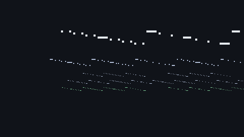

# WALKTHROUGH.md — architecture walkthrough (animated)

[](walkthrough.gif)

A 26-second, top-down, data-driven visualization of a **real 3v3 bot
match** running on the authoritative sim — the same `World` the dedicated
server drives. Every circle, wall, kill ring and score digit is read from
live sim state (seed 777, deterministic); nothing is pre-rendered or
animated by hand. Regenerates in ~40 s headless, in CI, no GPU.

## What the GIF shows (the architecture in one loop)

| On screen | What it is in the codebase |
|---|---|
| The whole scene, at 60 Hz | `core/state/world.gd::step(dt)` — the authoritative sim: movement, hits, kills, respawns, score. It runs headless (tests, dedicated server, offline mode) — rendering is an observer, never the source of truth. |
| The walls and cover boxes | Data-driven maps: `Arena.build(world)` from `content/maps/*.tres` (D18). Same map resource on server and client; the client's arena arrives over the wire as a map code. |
| Blue vs red circles (HP-scaled) | `CharacterEntity` instances. Humans and bots are the same class with the same controller interface (`BotController` here); the sim does not know who is driving. |
| Kill rings + kill feed | `World.world_event` signals (`kill`, `respawn`, `match_over`…) — the same events the net layer relays to clients as `E_*` packets. |
| The score bar | Authoritative score: only the server increments it, only the server declares `match_over`. |
| The bottom caption | The data path of every frame in a real match: **60 Hz server sim → 20 Hz snapshots → interpolated client views** (docs/NETWORKING.md §2-3). The client in a real match never simulates a second world — it renders what the server says happened. |

## Reading the frame layout

Top-down projection of the sim's X/Z plane (Y is altitude, unused in the
view). Top bar: game name + mode, authoritative score, sim clock. Right:
the last three kills (headshots flagged). Bottom: the architecture loop
that makes the rest of the project possible — because the sim is the
single source of truth, the *same* code path that produced this GIF
serves the match to real players.

## Regenerating

```bash
cd game
/path/to/godot --headless --path . res://tools/gen_walkthrough.tscn
# frames -> /tmp/walk53/  (260 PNGs, 10 fps capture of a 24 s match)
ffmpeg -framerate 10 -i /tmp/walk53/frame_%04d.png \
    -vf palettegen /tmp/walk53/pal.png
ffmpeg -framerate 10 -i /tmp/walk53/frame_%04d.png \
    -i /tmp/walk53/pal.png -lavfi paletteuse docs/walkthrough.gif
```

Implementation notes (gotchas learned building it):

- Godot 4.7's `Image` has no `draw_*` helpers (only `fill` / `fill_rect` /
  `set_pixel`) — the generator ships a Bresenham line, circle fill and
  circle outline, plus a 5×7 bitmap font (original, embedded in the
  script) so text needs no rendering server.
- `BoxShape3D` has no `get_aabb()` in 4.7 — the arena bounds are built
  from shape extents + mesh AABBs, 8 corners per node, transformed by the
  node's global transform.
- The sim is host-driven: `world.step(FIXED_DT)` + `server.tick(FIXED_DT)`
  per physics frame (same pattern as tests/test_net.gd) — the transport
  polls inside `tick()` and the World does not step itself.
